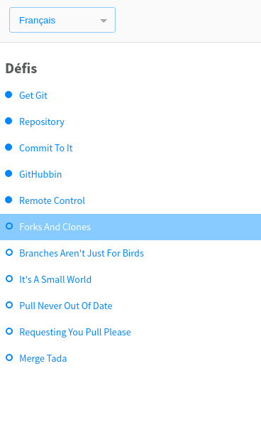

# Bases de Conception orientée objet 

### Université Gustave Eiffel

Ce sujet est directement repris de celui de l'IUT de Montpellier (c'est un fork du projet : https://github.com/IUTInfoMontp-M2103/TP1)

Les instructions de ce TP et de ceux qui vont suivre sont principalement détaillées pour les utilisateurs de Linux (Ubuntu ou autre). Nous vous encourageons d'utiliser Linux car pour plusieurs cours vous en aurez besoin plus tard et plus généralement en tant qu'informaticien, c'est important d'être familiarisé avec. 
Si tout de même vous préférez utiliser Windows ou Mac OS, une adaptation est possible, mais cela vous demandera un peu de travail de votre côté.
(Une solution intermédiaire peur consister à installer une VM sous windows, voir, tout simplement, WSL : Windows Subsystem for Linux)

## TP 1 : Rappels de Git et premier projet versionné

L'objectif de la première partie de ce TP est de vous rappeler les concepts principaux liés à la [gestion de version](https://fr.wikipedia.org/wiki/Gestion_de_versions) avec [Git](https://git-scm.com/). Cet outil vous sera indispensable durant l'apprentissage de ce cours mais également dans d'autres matières durant votre cursus. En tant que futur développeur, vous devriez apprendre à être organisé et à collaborer avec d'autres développeurs.

### Introduction à Git et préparation de l'environnement

Pour conserver vos réalisations et permettre à votre enseignant de suivre votre avancement vous allez apprendre à versionner votre travail avec Git sur la plateforme collaborative [GitHub](https://github.com/). Pendant ce module, vous allez principalement écrire du code pour vous-même et qui sera partagé avec vos enseignants. Car tout l'intérêt de travailler avec Git c'est de faciliter l'organisation de la __collaboration__.

#### Création d'un compte Github

En principe vous avez déjà un compte github. Si ce n'est pas le cas, créez-vous un compte github **avec votre adresse de l'IUT** (l'adresse en `@etud.u-pem.fr`). De cette façon là vous pourrez bénéficier du système Github classroom.

#### Prise en main de Git

Git est installé sur les postes Linux de l'IUT. Voici comment l'installer sur votre machine en fonction de votre système d'exploitation :
* Ubuntu ou une Debian : `sudo apt install git-all`
* une autre distribution Linux : https://git-scm.com/download/linux
* Windows : https://desktop.github.com/ - application gratuite proposée par GitHub qui vous permet d'installer le logiciel Git sous Windows et aussi une interface graphique appropriée
* Mac OS : https://git-scm.com/download/mac

**Configuration locale de Git**

Si ce n'est pas déjà fait, configurez correctement Git sur votre machine. Pour faire cela sur Linux, ouvrez le fichier `~/.gitconfig` avec votre éditeur de texte favori et renseignez votre nom, prénom et email dans la section `[user]`.
```
# Personnalisez les champs ci-dessous!
[user]
username = logingithub
name = Prénom Nom
email = login@etud.univ-eiffel.fr
```

Une autre façon de faire (qui marche sur tous les systèmes) :
```
git config --global user.name "Prénom Nom"
git config --global user.email login@etud.u-pem.fr
```

**Entraînez-vous avec le tutoriel interactif !**

Pour tester les premiers éléments de Git, je vous propose donc ici d'utiliser le tutoriel interactif **[Git-It](https://github.com/jlord/git-it-electron)**. 
C'est une application multi-plateforme qui contient des défis pour l'apprentissage, en utilisant vraiment Git et GitHub, pas des émulateurs. Ces défis sont à réaliser en ligne de commande et avec GitHub. À la fin, lorsque vous aurez terminé tous les défis, vous aurez de vrais dépôts sur votre compte GitHub avec vos contributions. Pour faire ce tutoriel :
  * Téléchargez le fichier **"Git-it-Linux-x64.zip"** (ou Mac, ou Windows) depuis ce site : https://github.com/jlord/git-it-electron/releases.
  * Décompressez-le dans votre répertoire principal (`$HOME` sur Linux) et lancez l'exécutable `Git-it`. Une interface en français plus ou moins bien traduite est également disponible... La première étape du tutoriel (sur la création d'un compte GitHub) peut être passée car vous l'avez déjà réalisée dans la précédente étape du TP.

Une fois que vous aurez réalisé le tutoriel interactif, faites une capture décran de la partie en haut à gauche qui marque votre réussite aux défis successifs, comme ceci:



Cette capture sera utilisée un peu plus loin dans le TP 

### Création de votre fork du TP1
Vous allez pouvoir commencer à travailler sur vos TP. Désormais le rendu, l'évaluation et le suivi de votre travail passeront par GitHub. La première chose que vous allez donc faire est de créer un fork d'un dépôt. Mais **attention**, pour cela vous n'utiliserez pas le bouton _fork_ classique de GitHub mais vous cliquerez sur **[CE LIEN](https://classroom.github.com/g/uovNVG2X)** !

GitHub va vous poser quelques questions pour vous identifier et vous demander de choisir une équipe. Pour ce TP (assignement) je vous demande de fonctionner par équipe de 2 (max). Choisissez un nom de binome du type : `gp-A-binomeX` où vous êtes dans le groupe A, dans le salon vocal `binomeX`.
Ensuite git va créer un dépôt __eiffel-dutinfo1/tp1-votreBinome__ contenant le fork du __cmorvan/TP1__. Le dépôt nouvellement créé sera privé et vous apparaîtrez automatiquement comme contributeur de ce projet pour y pousser votre travail.

Remarquez que ce fork privé sera automatiquement intégré dans l'organisation du cours : _eiffel-dutinfo1_. Ce qui implique que l'enseignant du module sera automatiquement admin de votre dépôt et pourra collaborer avec vous. Cette façon de faire permet d'une part de centraliser et uniformiser les rendus de chaque étudiant et, d'autre part, aux enseignants de suivre et aider plus facilement chaque étudiant en interagissant directement sur son dépôt. Cela permet également de partager plus facilement une base de code et veiller au respect des consignes en y intégrant une batterie de tests. Mais cette dernière partie on la verra plus tard...

Précision, pour ce tp comme pour les suivants, vous serez autorisés à travailler en groupe, en équipes jusqu'à 2 personnes. Je souhaite au maximum que vous fonctionniez en binôme sur les tp de *conception orientée objets*.

Vous allez cloner le fork GitHub '*eiffel-dutinf1/tp1-votreUsername*' sur votre machine et travailler désormais localement tout en "versionnant" votre code et en poussant régulièrement vos réalisations.

### À faire pour chaque exercice 
Une fois qu'un exercice sera terminé, n'oubliez pas de pousser vos modifications sur votre fork de la manière suivante (dans cet exemple on suppose que vous êtes sur la branche `master`) :
```sh
~/tpPOO/tp1-VotreUsername$ git add fichiers_que_vous_avez_modifié
~/tpPOO/tp1-VotreUsername$ git commit -m "Validation de l'exercice 1"
~/tpPOO/tp1-VotreUsername$ git push origin master
```

**Remarque importante** : Rappelez-vous qu'un dépôt contient uniquement les fichiers nécessaires pour qu'un collaborateur puisse reconstruire le projet dans son propre environnement, et surtout _rien de plus_. Donc aucune information personnelle, aucun résultat de compilation, aucune configuration de son propre environnement de travail. D'ailleurs, vous avez tout intérêt à éditer un fichier `.gitignore` à la racine de votre dépôt (fichier que vous commitez comme n'importe quel autre fichier utile à votre dépot). Ce fichier contient des motifs de fichiers qui doivent être ignorés par git.

### Exercice 1 : Insertion de la capture de vos résultats dans *git-it*

1. Créez un dossier `git-it`
1. Dans ce dossier copiez la capture que vous avez faite au terme du tutoriel *git-it*
1. Appelez cette image `exercice1` avec la bonne extension selon le type d'image (`.png` ou `.jpg`)
1. Ajouté le dossier `git-it` aux fichiers _staged_. 
1. Poussez vos modifications.

### Exercice 2 : Bonjour le monde
Dans la méthode principale de la classe `HelloWorld` faites afficher le message _"Bonjour le monde"_.
1. Dans un terminal, compilez, exécutez et vérifiez votre programme.
2. Versionnez l'intégralité de votre travail avec `git add .` + `git commit`.
3. Faites un `git push` sur le dépôt GitHub et comparez avec votre répertoire local. Quelle différence constatez-vous et pourquoi ?

En règle générale une séparation entre le code source et le byte code est nécessaire pour une meilleure lisibilité de votre programme. Ce qui est généralement conseillé c'est d'avoir au moins deux répertoires à la racine de votre projet. Par exemple `src` + `bin` ou encore `src` + `target`. Pour les différentes options de compilation : https://docs.oracle.com/javase/8/docs/technotes/tools/unix/javac.html

### Exercice 3 : Historique de Git
Créez un fichier texte `exercice3.txt` à  la racine de votre dépôt TP1. Vous noterez quelques éléments sur chacune des questions relatives à cet exercice.

Pour aller un peu plus loin, vous pouvez à présent cloner localement le dépôt oficiel de Git : https://git.kernel.org/pub/scm/git/git.git

**Attention** : ne clonez pas ce dépot dans votre dépot `TP1`, mais faites-le dans un autre dossier.

1. Dans ce dépot, examinez l'historique avec la commande: `git log --color --oneline --graph` (dans le fichier `.gitconfig` dans votre dossier `home` vous pouvez créer un alias pour cette commande qui permet d'avoir une vision concise et graphique de l'historique.)
1. Retrouvez le premier commit de git et placez-vous sur ce commit.
1. Examiner les fichiers que vous y trouvez et en particulier le `README`.
1. Créez une nouvelle branche `mon-git` à partir de cette situation. 
1. Sur votre github crez un nouveau dépôt qui vous ajouterez en tant que serveur distant pour le dépôt actuel. 
1. Poussez votre dépôt sur votre dépôt distant. 
1. Allez voir votre dépôt sur github. Est-ce que tout est bien conforme ?
1. Sur github, pouvez-vous voir la branche `master`. Qu'en pensez-vous ?


